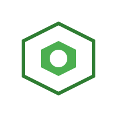

# Welcome

## Nexios Framework

A modern, high-performance framework for building scalable applications

### About Nexios

Nexios is a powerful, lightweight framework designed to help developers build robust applications with ease. With a focus on performance and developer experience, Nexios provides the tools you need to create modern applications quickly and efficiently.

### Key Features

- &#x20;**High Performance**: Optimized for speed and efficiency
- &#x20;**Reactive**: Built-in reactivity system for dynamic UIs
- &#x20;**Modular**: Composable architecture for better code organization
- **Developer Friendly**: Intuitive APIs and comprehensive documentation
- &#x20;**Lightweight**: Minimal footprint with no unnecessary dependencies
- &#x20;**Extensible**: Robust plugin system for custom functionality
- &#x20;**CLI Tools**: Powerful [command-line interface](fundamentals/cli-tools.md) for project scaffolding and development
