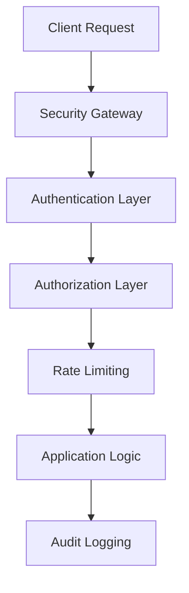

# Day 21: Advanced Security and Compliance

## Overview
Today we'll explore enterprise-grade security implementations and compliance requirements for Nexios applications.

## Learning Objectives
- Implement advanced security patterns
- Understand compliance frameworks
- Master security best practices
- Configure audit logging and monitoring
- Deploy secure communication patterns

## Topics

### 1. Enterprise Security Architecture



### 2. Multi-Factor Authentication
```python
from nexios.security import MFAHandler
from nexios.auth import TOTPProvider, SMSProvider

mfa = MFAHandler(
    providers=[
        TOTPProvider(issuer="Nexios App"),
        SMSProvider(service="twilio")
    ],
    required_factors=2
)

@app.route("/login", methods=["POST"])
@mfa.protect
async def secure_login(request):
    # Handle MFA-protected login
    await mfa.verify(request)
    return {"status": "authenticated"}
```

### 3. Advanced Authorization

```python
from nexios.security import PolicyEngine
from nexios.rbac import RoleManager

# Define complex authorization policies
policy_engine = PolicyEngine()

@policy_engine.define("document_access")
def can_access_document(user, document):
    return (
        user.has_role("editor") and
        document.department in user.departments and
        user.security_clearance >= document.required_clearance
    )

# Role hierarchy management
roles = RoleManager()
roles.add_hierarchy({
    "admin": ["manager", "editor"],
    "manager": ["editor"],
    "editor": ["viewer"]
})
```

### 4. Security Monitoring and Alerts

```python
from nexios.monitoring import SecurityMonitor
from nexios.alerts import AlertManager

# Configure security monitoring
monitor = SecurityMonitor(
    watch_patterns=[
        "failed_login_attempts",
        "unauthorized_access",
        "data_exfiltration"
    ],
    threshold_alerts={
        "failed_login_attempts": 5,  # Alert after 5 failures
        "unauthorized_access": 1     # Alert on first occurrence
    }
)

# Alert configuration
alerts = AlertManager(
    channels=[
        "email",
        "slack",
        "pagerduty"
    ],
    severity_levels={
        "high": ["pagerduty", "email"],
        "medium": ["slack", "email"],
        "low": ["email"]
    }
)
```

### 5. Compliance Implementation

```python
from nexios.compliance import ComplianceManager
from nexios.audit import AuditLogger

compliance = ComplianceManager(
    frameworks=["GDPR", "HIPAA", "SOC2"],
    data_retention_policy={
        "user_data": 30,  # days
        "audit_logs": 365,
        "backups": 90
    }
)

audit = AuditLogger(
    storage="elasticsearch",
    retention_days=365,
    encryption_enabled=True
)
```

## Practical Exercises

1. Implement MFA with backup codes
2. Set up role-based access control
3. Configure security monitoring
4. Create compliance reports
5. Set up audit logging

## Best Practices

1. Always encrypt sensitive data
2. Implement defense in depth
3. Follow the principle of least privilege
4. Regular security audits
5. Maintain comprehensive logs
6. Use secure communication channels

## Homework Assignment

1. Implement a complete security suite
2. Create security test cases
3. Set up monitoring and alerts
4. Document security measures
5. Create an incident response plan

## Additional Resources

- [OWASP Security Guidelines](https://owasp.org/)
- [GDPR Documentation](https://gdpr.eu/)
- [NIST Cybersecurity Framework](https://www.nist.gov/cyberframework)
- [Nexios Security Best Practices](https://nexios.io/security)