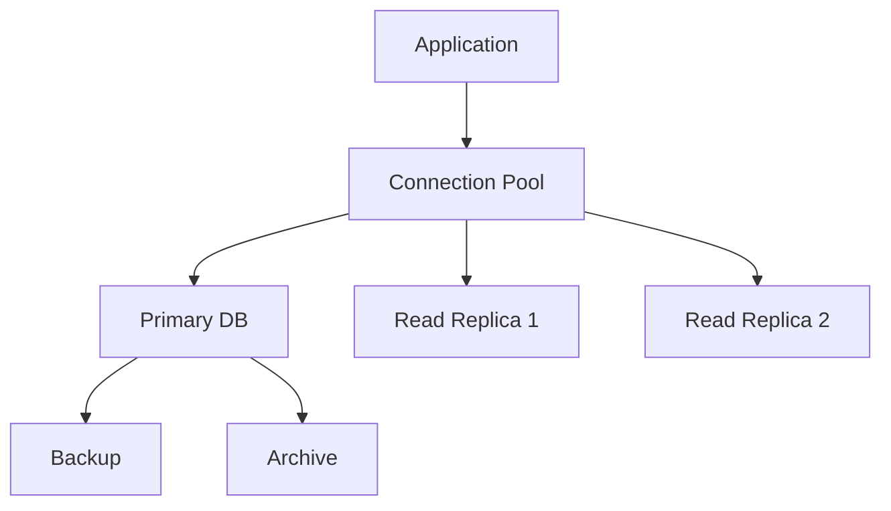

# Day 22: Advanced Database Patterns and Optimization

## Overview
Today we'll explore advanced database patterns, optimization techniques, and scaling strategies in Nexios applications.

## Learning Objectives
- Master database optimization techniques
- Implement advanced query patterns
- Understand database scaling strategies
- Configure database monitoring
- Implement data migration patterns

## Topics

### 1. Database Architecture Patterns



### 2. Advanced Query Optimization

```python
from nexios.db import QueryOptimizer, IndexManager
from nexios.models import User, Order

# Query optimization
optimizer = QueryOptimizer()

@optimizer.optimize
async def get_user_orders(user_id: int):
    return await Order.select(
        Order.id,
        Order.status,
        Order.total
    ).join(
        User,
        on=(Order.user_id == User.id)
    ).where(
        User.id == user_id
    ).order_by(
        Order.created_at.desc()
    ).limit(100)

# Index management
index_manager = IndexManager()
index_manager.create_index(
    table="orders",
    columns=["user_id", "created_at"],
    index_type="btree"
)
```

### 3. Database Scaling Patterns

```python
from nexios.db import ShardManager, ReplicaManager

# Sharding configuration
shard_manager = ShardManager(
    shard_key="user_id",
    shard_function="hash",
    num_shards=4,
    shard_map={
        0: "db-shard-1",
        1: "db-shard-2",
        2: "db-shard-3",
        3: "db-shard-4"
    }
)

# Replica management
replica_manager = ReplicaManager(
    primary="db-primary",
    replicas=[
        "db-replica-1",
        "db-replica-2"
    ],
    read_preference="nearest"
)
```

### 4. Database Monitoring and Performance

```python
from nexios.monitoring import DBMonitor
from nexios.metrics import MetricsCollector

# Database monitoring
monitor = DBMonitor(
    watch_metrics=[
        "query_duration",
        "connection_count",
        "cache_hit_ratio",
        "deadlock_count"
    ],
    alert_thresholds={
        "query_duration": 1000,  # ms
        "connection_count": 100,
        "deadlock_count": 5
    }
)

# Metrics collection
metrics = MetricsCollector(
    storage="prometheus",
    export_interval=60,  # seconds
    labels={
        "environment": "production",
        "service": "user-api"
    }
)
```

### 5. Data Migration and Versioning

```python
from nexios.db import MigrationManager
from nexios.schema import SchemaVersion

# Migration management
migrations = MigrationManager()

@migrations.version("1.0.0")
async def create_users_table():
    await db.execute("""
        CREATE TABLE users (
            id SERIAL PRIMARY KEY,
            email VARCHAR(255) UNIQUE,
            created_at TIMESTAMP DEFAULT NOW()
        )
    """)

@migrations.version("1.1.0")
async def add_user_status():
    await db.execute("""
        ALTER TABLE users
        ADD COLUMN status VARCHAR(50) DEFAULT 'active'
    """)
```

## Practical Exercises

1. Optimize complex queries
2. Set up database replication
3. Implement sharding strategy
4. Configure monitoring
5. Create data migrations

## Best Practices

1. Always use connection pooling
2. Implement proper indexing
3. Regular performance monitoring
4. Maintain data consistency
5. Plan for scalability
6. Regular backups and testing

## Homework Assignment

1. Optimize a complex database query
2. Implement read replicas
3. Set up monitoring and alerts
4. Create migration scripts
5. Document optimization strategies

## Additional Resources

- [Database Optimization Guide](https://nexios.io/db-optimization)
- [PostgreSQL Documentation](https://www.postgresql.org/docs/)
- [Database Scaling Patterns](https://nexios.io/scaling)
- [Migration Best Practices](https://nexios.io/migrations) 