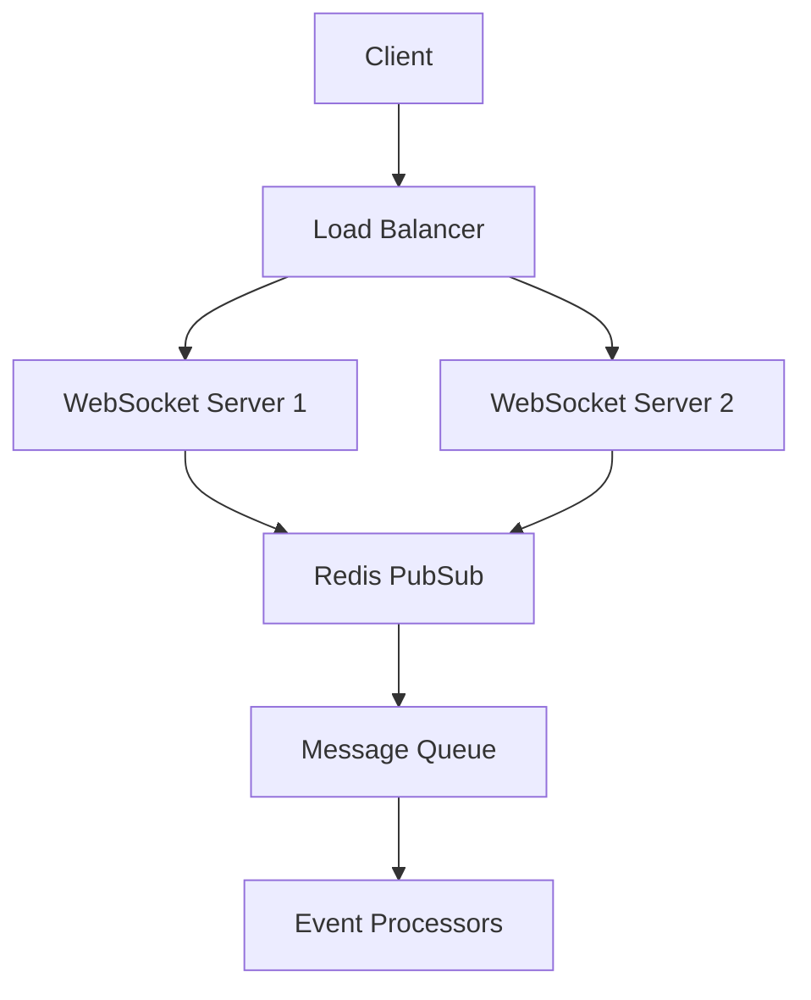

# Day 23: Advanced WebSocket and Real-time Communication

## Overview
Today we'll explore advanced WebSocket patterns, real-time communication strategies, and scaling WebSocket applications in Nexios.

## Learning Objectives
- Master WebSocket implementation patterns
- Implement real-time communication strategies
- Understand WebSocket scaling
- Configure WebSocket security
- Implement pub/sub patterns

## Topics

### 1. WebSocket Architecture Patterns



### 2. Advanced WebSocket Implementation

```python
from nexios.websocket import WebSocketManager
from nexios.pubsub import PubSubHandler

# WebSocket manager configuration
ws_manager = WebSocketManager(
    heartbeat_interval=30,
    reconnect_strategy="exponential",
    compression_enabled=True
)

@ws_manager.on_connect
async def handle_connection(socket):
    user = await authenticate_socket(socket)
    await socket.subscribe(f"user:{user.id}")
    await socket.send_json({
        "type": "connected",
        "user_id": user.id
    })

@ws_manager.on_message
async def handle_message(socket, message):
    # Handle incoming messages
    event = await validate_message(message)
    await process_event(socket, event)
```

### 3. Real-time Communication Patterns

```python
from nexios.realtime import RoomManager, Presence

# Room management for group communication
rooms = RoomManager()

@rooms.on_join
async def handle_room_join(socket, room_id):
    # Track user presence
    await Presence.track(socket.user_id, room_id)
    
    # Notify room members
    await rooms.broadcast(room_id, {
        "type": "user_joined",
        "user_id": socket.user_id
    })

# Presence system implementation
presence = Presence(
    heartbeat_interval=60,
    stale_threshold=180
)

@presence.on_status_change
async def handle_status_change(user_id, status):
    await notify_status_subscribers(user_id, status)
```

### 4. WebSocket Security and Authentication

```python
from nexios.security import WSAuthenticator
from nexios.crypto import TokenManager

# WebSocket authentication
ws_auth = WSAuthenticator(
    token_manager=TokenManager(),
    allowed_origins=["https://app.example.com"],
    rate_limit=100  # messages per minute
)

@ws_auth.authenticate
async def authenticate_socket(socket):
    token = socket.query_params.get("token")
    user = await ws_auth.validate_token(token)
    
    if not user:
        raise WSAuthError("Invalid token")
    
    socket.user = user
    return user
```

### 5. Scaling WebSocket Applications

```python
from nexios.scaling import WSScaler
from nexios.cluster import ClusterManager

# WebSocket scaling configuration
scaler = WSScaler(
    sticky_sessions=True,
    max_connections_per_node=10000,
    cluster_strategy="least_connections"
)

# Cluster management
cluster = ClusterManager(
    nodes=[
        "ws-node-1:8000",
        "ws-node-2:8000",
        "ws-node-3:8000"
    ],
    sync_strategy="redis"
)

@cluster.on_node_change
async def handle_node_change(node, status):
    if status == "down":
        await redistribute_connections(node)
```

## Practical Exercises

1. Build a real-time chat application
2. Implement presence tracking
3. Set up WebSocket clustering
4. Configure security measures
5. Implement pub/sub patterns

## Best Practices

1. Use heartbeat mechanisms
2. Implement reconnection strategies
3. Handle connection state properly
4. Scale horizontally
5. Monitor connection health
6. Implement proper error handling

## Homework Assignment

1. Create a scalable chat system
2. Implement presence features
3. Add security measures
4. Set up monitoring
5. Document scaling strategy

## Additional Resources

- [WebSocket Protocol RFC](https://tools.ietf.org/html/rfc6455)
- [Nexios WebSocket Guide](https://nexios.io/websocket)
- [Real-time Patterns](https://nexios.io/realtime)
- [Scaling WebSocket Applications](https://nexios.io/scaling-websockets) 