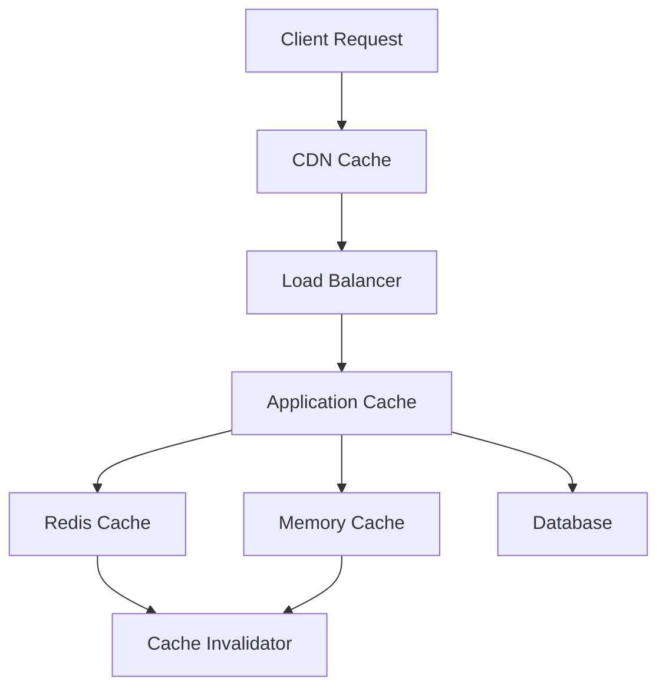

# Day 24: Advanced Caching and Performance Optimization

## Overview
Today we'll explore advanced caching strategies, performance optimization techniques, and how to implement them effectively in Nexios applications.

## Learning Objectives
- Master caching strategies
- Implement performance optimizations
- Understand cache invalidation
- Configure distributed caching
- Implement content delivery optimization

## Topics

### 1. Caching Architecture Patterns



### 2. Multi-level Caching Implementation

```python
from nexios.cache import CacheManager, RedisCache, MemoryCache
from nexios.cache.strategies import LRU, TTL

# Configure multi-level cache
cache_manager = CacheManager(
    layers=[
        MemoryCache(
            max_size=1000,
            strategy=LRU(),
            ttl=300  # 5 minutes
        ),
        RedisCache(
            url="redis://cache:6379",
            strategy=TTL(3600)  # 1 hour
        )
    ],
    write_strategy="write-through"
)

@cache_manager.cached(key_prefix="user")
async def get_user_profile(user_id: int):
    return await db.fetch_one(
        "SELECT * FROM users WHERE id = :id",
        {"id": user_id}
    )
```

### 3. Cache Invalidation Patterns

```python
from nexios.cache import InvalidationManager
from nexios.events import EventBus

# Cache invalidation configuration
invalidator = InvalidationManager(
    strategy="pattern-based",
    patterns={
        "user:*": 3600,      # User data expires in 1 hour
        "product:*": 7200,   # Product data expires in 2 hours
        "config:*": 300      # Config expires in 5 minutes
    }
)

# Event-based invalidation
event_bus = EventBus()

@event_bus.on("user_updated")
async def invalidate_user_cache(user_id: int):
    patterns = [
        f"user:{user_id}",
        f"user:{user_id}:profile",
        f"user:{user_id}:settings"
    ]
    await invalidator.invalidate_patterns(patterns)
```

### 4. Performance Monitoring and Optimization

```python
from nexios.monitoring import PerformanceMonitor
from nexios.optimization import QueryOptimizer

# Performance monitoring
monitor = PerformanceMonitor(
    metrics=[
        "response_time",
        "cache_hit_ratio",
        "memory_usage",
        "cpu_usage"
    ],
    alert_thresholds={
        "response_time": 500,  # ms
        "cache_hit_ratio": 0.8,
        "memory_usage": 0.9    # 90% usage
    }
)

# Query optimization
optimizer = QueryOptimizer(
    cache_enabled=True,
    prepared_statements=True,
    connection_pool=True
)

@optimizer.optimize
async def get_user_orders(user_id: int):
    cache_key = f"user:{user_id}:orders"
    
    # Try cache first
    if cached := await cache_manager.get(cache_key):
        return cached
    
    # Query with optimization
    result = await db.fetch_all("""
        SELECT o.* 
        FROM orders o
        WHERE o.user_id = :user_id
        ORDER BY o.created_at DESC
        LIMIT 100
    """, {"user_id": user_id})
    
    # Cache the result
    await cache_manager.set(cache_key, result, ttl=300)
    return result
```

### 5. Content Delivery Optimization

```python
from nexios.cdn import CDNManager
from nexios.compression import CompressionHandler

# CDN configuration
cdn = CDNManager(
    providers=["cloudfront", "fastly"],
    regions=["us-east", "eu-west", "asia-east"],
    cache_control={
        "images": 86400,      # 1 day
        "static": 604800,     # 1 week
        "dynamic": 300        # 5 minutes
    }
)

# Compression handling
compression = CompressionHandler(
    algorithms=["gzip", "brotli"],
    min_size=1024,  # Only compress responses larger than 1KB
    content_types=[
        "text/html",
        "application/json",
        "text/css",
        "application/javascript"
    ]
)
```

## Practical Exercises

1. Implement multi-level caching
2. Set up cache invalidation
3. Configure CDN integration
4. Optimize database queries
5. Implement performance monitoring

## Best Practices

1. Use appropriate cache strategies
2. Implement proper cache invalidation
3. Monitor cache performance
4. Optimize database queries
5. Use content compression
6. Implement CDN properly

## Homework Assignment

1. Design a caching strategy
2. Implement cache invalidation
3. Set up performance monitoring
4. Optimize slow queries
5. Document optimization results

## Additional Resources

- [Caching Best Practices](https://nexios.io/caching)
- [Redis Documentation](https://redis.io/documentation)
- [CDN Implementation Guide](https://nexios.io/cdn)
- [Performance Optimization Guide](https://nexios.io/performance)