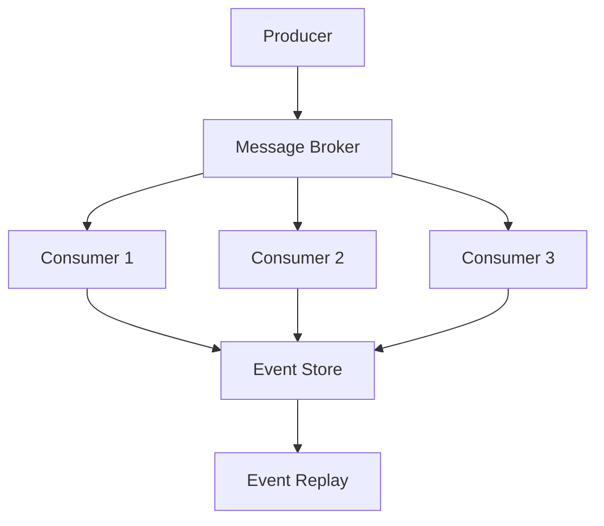

# Day 25: Event-Driven Architecture and Message Queues

## Overview
Today we'll explore event-driven architecture patterns, message queues, and how to build scalable event-driven systems with Nexios.

## Learning Objectives
- Master event-driven patterns
- Implement message queues
- Understand event sourcing
- Configure event handlers
- Implement pub/sub patterns

## Topics

### 1. Event-Driven Architecture



### 2. Event Publishing and Handling

```python
from nexios.events import EventBus, EventHandler
from nexios.messaging import MessageBroker

# Configure event bus
event_bus = EventBus(
    broker=MessageBroker(
        url="amqp://rabbitmq:5672",
        exchange="app_events",
        queue_prefix="app"
    )
)

# Event handler
@event_bus.handler("user.created")
async def handle_user_created(event):
    user_id = event.data["user_id"]
    
    # Send welcome email
    await email_service.send_welcome(user_id)
    
    # Create initial settings
    await settings_service.initialize(user_id)

# Event publishing
@event_bus.publish("order.placed")
async def place_order(order_data):
    order = await Order.create(order_data)
    return {
        "order_id": order.id,
        "user_id": order.user_id,
        "total": order.total
    }
```

### 3. Message Queue Implementation

```python
from nexios.queue import QueueManager, Worker
from nexios.retry import RetryStrategy

# Queue configuration
queue_manager = QueueManager(
    brokers=["rabbitmq:5672", "rabbitmq:5673"],
    queues={
        "high_priority": {"prefetch": 10, "ttl": 3600},
        "default": {"prefetch": 50, "ttl": 7200},
        "low_priority": {"prefetch": 100, "ttl": 14400}
    }
)

# Worker implementation
@queue_manager.worker("order_processing")
class OrderProcessor(Worker):
    retry_strategy = RetryStrategy(
        max_retries=3,
        delay=5,
        backoff=2
    )
    
    async def process(self, message):
        order_id = message.data["order_id"]
        
        try:
            # Process order
            await self.process_order(order_id)
            
            # Mark as completed
            await message.ack()
        except Exception as e:
            # Handle failure
            await message.retry()
```

### 4. Event Sourcing Pattern

```python
from nexios.events import EventStore, EventStream
from nexios.models import AggregateRoot

# Event store configuration
event_store = EventStore(
    storage="postgres",
    table="event_log",
    serializer="json"
)

# Aggregate root implementation
class Order(AggregateRoot):
    def __init__(self, id: str):
        self.id = id
        self.status = "pending"
        self.items = []
        
    @classmethod
    async def create(cls, order_id: str):
        order = cls(order_id)
        await order.apply_event("OrderCreated", {
            "order_id": order_id,
            "created_at": datetime.now()
        })
        return order
    
    async def add_item(self, item_id: str, quantity: int):
        await self.apply_event("ItemAdded", {
            "item_id": item_id,
            "quantity": quantity
        })
        
    async def apply_event(self, event_type: str, data: dict):
        # Store event
        await event_store.append(
            stream=f"order-{self.id}",
            event_type=event_type,
            data=data
        )
        
        # Update state
        await self.handle_event(event_type, data)
```

### 5. Event Replay and Recovery

```python
from nexios.events import EventReplay
from nexios.recovery import RecoveryManager

# Event replay configuration
replay = EventReplay(
    event_store=event_store,
    batch_size=100,
    parallel_streams=5
)

# Recovery manager
recovery = RecoveryManager(
    checkpoint_interval=1000,
    snapshot_enabled=True
)

async def rebuild_order_state(order_id: str):
    # Create new order instance
    order = Order(order_id)
    
    # Get event stream
    stream = await event_store.get_stream(f"order-{order_id}")
    
    # Replay events
    async for event in stream:
        await order.handle_event(
            event.type,
            event.data
        )
    
    return order
```

## Practical Exercises

1. Build an event-driven system
2. Implement message queues
3. Set up event sourcing
4. Configure event handlers
5. Implement event replay

## Best Practices

1. Ensure event idempotency
2. Implement proper error handling
3. Use event versioning
4. Monitor queue health
5. Implement dead letter queues
6. Handle event ordering

## Homework Assignment

1. Create an event-driven app
2. Implement message queues
3. Add event sourcing
4. Set up monitoring
5. Document event flows

## Additional Resources

- [Event-Driven Architecture](https://nexios.io/event-driven)
- [RabbitMQ Documentation](https://www.rabbitmq.com/documentation.html)
- [Event Sourcing Pattern](https://nexios.io/event-sourcing)
- [Message Queue Patterns](https://nexios.io/queues) 