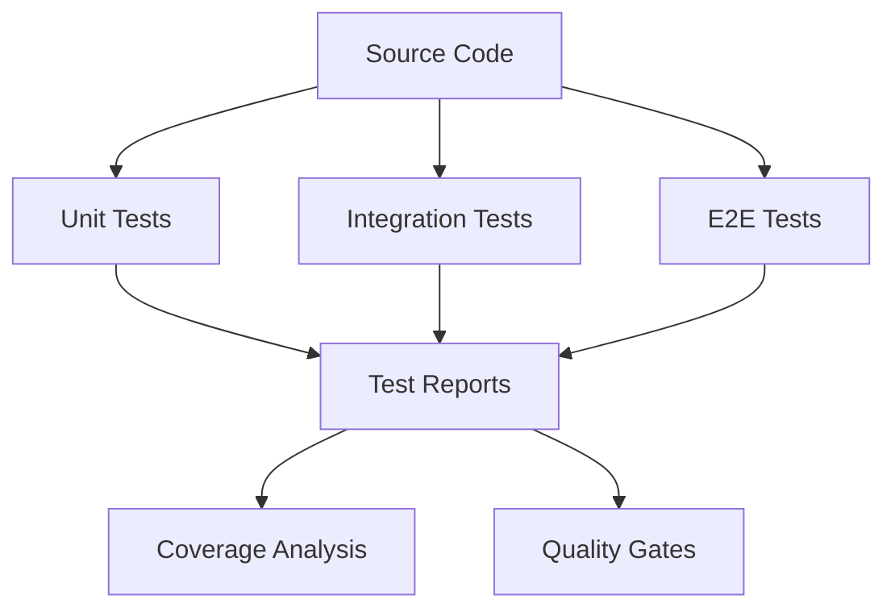

# Day 26: Advanced Testing and Quality Assurance

## Overview
Today we'll explore advanced testing strategies, quality assurance practices, and how to implement comprehensive testing in Nexios applications.

## Learning Objectives
- Master testing strategies
- Implement test automation
- Understand test coverage
- Configure CI/CD testing
- Implement performance testing

## Topics

### 1. Testing Architecture



### 2. Unit Testing Implementation

```python
from nexios.testing import TestCase, TestSuite
from nexios.assertions import assert_async

class UserServiceTests(TestCase):
    async def setUp(self):
        self.db = await TestDatabase.create()
        self.user_service = UserService(self.db)
    
    async def tearDown(self):
        await self.db.cleanup()
    
    @assert_async
    async def test_user_creation(self):
        user_data = {
            "email": "test@example.com",
            "name": "Test User"
        }
        
        user = await self.user_service.create_user(user_data)
        
        self.assertIsNotNone(user.id)
        self.assertEqual(user.email, user_data["email"])
        self.assertEqual(user.name, user_data["name"])
    
    @assert_async
    async def test_user_validation(self):
        invalid_data = {
            "email": "invalid-email",
            "name": ""
        }
        
        with self.assertRaises(ValidationError):
            await self.user_service.create_user(invalid_data)
```

### 3. Integration Testing

```python
from nexios.testing import IntegrationTest
from nexios.mocks import MockService

class OrderFlowTests(IntegrationTest):
    async def setUp(self):
        self.app = await TestApp.create()
        self.payment_service = MockService("payment")
        self.email_service = MockService("email")
    
    @assert_async
    async def test_order_creation_flow(self):
        # Setup test data
        user = await self.create_test_user()
        product = await self.create_test_product()
        
        # Mock external services
        self.payment_service.mock_response(
            "process_payment",
            {"status": "success", "transaction_id": "tx123"}
        )
        
        # Execute test
        order = await self.app.client.post("/orders", json={
            "user_id": user.id,
            "product_id": product.id,
            "quantity": 1
        })
        
        # Verify results
        self.assertEqual(order.status, "confirmed")
        self.assertTrue(self.payment_service.was_called("process_payment"))
        self.assertTrue(self.email_service.was_called("send_confirmation"))
```

### 4. Performance Testing

```python
from nexios.testing import PerformanceTest
from nexios.metrics import MetricsCollector

class APIPerformanceTests(PerformanceTest):
    async def setUp(self):
        self.metrics = MetricsCollector()
        self.load_generator = LoadGenerator(
            target_url="http://api:8000",
            concurrent_users=100,
            ramp_up_time=30
        )
    
    @assert_async
    async def test_api_performance(self):
        # Configure test scenarios
        scenarios = [
            Scenario("list_users", "/users", "GET"),
            Scenario("create_user", "/users", "POST", payload={
                "email": "user{n}@example.com",
                "name": "User {n}"
            }),
            Scenario("get_user", "/users/{user_id}", "GET")
        ]
        
        # Run load test
        results = await self.load_generator.run(
            scenarios=scenarios,
            duration=300,  # 5 minutes
            metrics=[
                "response_time",
                "throughput",
                "error_rate"
            ]
        )
        
        # Assert performance requirements
        self.assertResponseTime(results, "p95", max_ms=200)
        self.assertThroughput(results, min_rps=100)
        self.assertErrorRate(results, max_percentage=1)
```

### 5. Test Automation and CI/CD

```python
from nexios.ci import Pipeline, Stage
from nexios.testing import TestRunner

# Pipeline configuration
pipeline = Pipeline(
    name="test-pipeline",
    triggers=["push", "pull_request"]
)

@pipeline.stage("unit-tests")
async def run_unit_tests():
    runner = TestRunner(
        test_path="tests/unit",
        parallel=True,
        timeout=300
    )
    results = await runner.run()
    assert results.success_rate >= 0.95

@pipeline.stage("integration-tests")
async def run_integration_tests():
    runner = TestRunner(
        test_path="tests/integration",
        parallel=True,
        timeout=600,
        environment={
            "DATABASE_URL": "postgresql://test:test@db:5432/test",
            "REDIS_URL": "redis://cache:6379/0"
        }
    )
    results = await runner.run()
    assert results.success_rate >= 0.90

@pipeline.stage("performance-tests")
async def run_performance_tests():
    runner = TestRunner(
        test_path="tests/performance",
        parallel=False,
        timeout=1800
    )
    results = await runner.run()
    assert results.performance_criteria_met
```

## Practical Exercises

1. Write comprehensive unit tests
2. Implement integration tests
3. Set up performance testing
4. Configure test automation
5. Implement CI/CD pipeline

## Best Practices

1. Write testable code
2. Use test fixtures
3. Implement proper mocking
4. Maintain test coverage
5. Automate testing process
6. Monitor test metrics

## Homework Assignment

1. Create test suite
2. Implement CI/CD pipeline
3. Add performance tests
4. Set up test monitoring
5. Document test strategy

## Additional Resources

- [Testing Best Practices](https://nexios.io/testing)
- [PyTest Documentation](https://docs.pytest.org/)
- [Performance Testing Guide](https://nexios.io/performance-testing)
- [CI/CD Implementation](https://nexios.io/ci-cd)