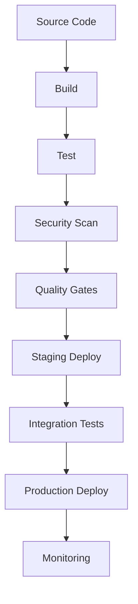

# Day 27: CI/CD and DevOps Best Practices

## Overview
Today we'll explore continuous integration, continuous deployment, and DevOps best practices for Nexios applications.

## Learning Objectives
- Master CI/CD pipelines
- Implement automated deployments
- Understand DevOps practices
- Configure deployment strategies
- Implement infrastructure as code

## Topics

### 1. CI/CD Pipeline Architecture



### 2. GitHub Actions Pipeline

```yaml
# .github/workflows/nexios-pipeline.yml
name: Nexios CI/CD Pipeline

on:
  push:
    branches: [ main ]
  pull_request:
    branches: [ main ]

jobs:
  build:
    runs-on: ubuntu-latest
    steps:
      - uses: actions/checkout@v3
      
      - name: Set up Python
        uses: actions/setup-python@v4
        with:
          python-version: '3.11'
          
      - name: Install dependencies
        run: |
          python -m pip install --upgrade pip
          pip install poetry
          poetry install
          
      - name: Run tests
        run: |
          poetry run pytest tests/
          poetry run coverage report
          
      - name: Build package
        run: poetry build
        
  security:
    needs: build
    runs-on: ubuntu-latest
    steps:
      - name: Security scan
        uses: snyk/actions/python@master
        env:
          SNYK_TOKEN: ${{ secrets.SNYK_TOKEN }}
          
  deploy-staging:
    needs: security
    runs-on: ubuntu-latest
    steps:
      - name: Deploy to staging
        uses: azure/webapps-deploy@v2
        with:
          app-name: 'nexios-staging'
          publish-profile: ${{ secrets.AZURE_WEBAPP_PUBLISH_PROFILE }}
```

### 3. Automated Deployment Configuration

```python
from nexios.deploy import DeploymentManager
from nexios.config import ConfigManager

# Deployment configuration
deploy_manager = DeploymentManager(
    environments={
        "staging": {
            "url": "https://staging.nexios.io",
            "replicas": 2,
            "resources": {
                "cpu": "1",
                "memory": "2Gi"
            }
        },
        "production": {
            "url": "https://nexios.io",
            "replicas": 4,
            "resources": {
                "cpu": "2",
                "memory": "4Gi"
            }
        }
    }
)

# Configuration management
config_manager = ConfigManager(
    sources=[
        "env_vars",
        "config_files",
        "secrets_manager"
    ],
    environments=[
        "development",
        "staging",
        "production"
    ]
)

@deploy_manager.deployment("staging")
async def deploy_staging():
    # Load configuration
    config = await config_manager.load("staging")
    
    # Apply database migrations
    await run_migrations()
    
    # Deploy application
    deployment = await deploy_manager.deploy(
        image="nexios:latest",
        config=config,
        strategy="rolling"
    )
    
    # Run smoke tests
    await run_smoke_tests(deployment)
```

### 4. Infrastructure as Code

```python
from nexios.infrastructure import Infrastructure
from nexios.providers import AzureProvider

# Infrastructure configuration
infra = Infrastructure(
    provider=AzureProvider(
        subscription_id="your-subscription-id",
        tenant_id="your-tenant-id"
    )
)

# Resource group
resource_group = infra.resource_group(
    name="nexios-production",
    location="eastus2"
)

# Virtual network
vnet = infra.virtual_network(
    name="nexios-vnet",
    address_space=["10.0.0.0/16"],
    subnets=[
        {
            "name": "app-subnet",
            "address_prefix": "10.0.1.0/24"
        },
        {
            "name": "db-subnet",
            "address_prefix": "10.0.2.0/24"
        }
    ]
)

# Database
database = infra.database(
    name="nexios-db",
    engine="postgresql",
    version="13",
    size="Standard_D2s_v3",
    storage_gb=100,
    backup_retention_days=7
)

# Application service
app_service = infra.app_service(
    name="nexios-app",
    sku="P1v2",
    runtime="python|3.11",
    app_settings={
        "WEBSITE_HTTPLOGGING_RETENTION_DAYS": "7",
        "APPLICATIONINSIGHTS_CONNECTION_STRING": "..."
    }
)
```

### 5. Monitoring and Alerts

```python
from nexios.monitoring import MonitoringManager
from nexios.alerts import AlertManager

# Monitoring configuration
monitoring = MonitoringManager(
    providers=[
        "azure_monitor",
        "prometheus",
        "grafana"
    ],
    metrics=[
        "http_requests",
        "response_time",
        "error_rate",
        "cpu_usage",
        "memory_usage"
    ]
)

# Alert configuration
alerts = AlertManager(
    channels=[
        "email",
        "slack",
        "pagerduty"
    ],
    rules=[
        {
            "name": "high_error_rate",
            "condition": "error_rate > 5%",
            "window": "5m",
            "severity": "critical"
        },
        {
            "name": "high_latency",
            "condition": "p95_response_time > 500ms",
            "window": "10m",
            "severity": "warning"
        }
    ]
)
```

## Practical Exercises

1. Set up CI/CD pipeline
2. Implement automated deployments
3. Configure infrastructure as code
4. Set up monitoring and alerts
5. Implement deployment strategies

## Best Practices

1. Automate everything
2. Use infrastructure as code
3. Implement proper monitoring
4. Use deployment strategies
5. Maintain security standards
6. Document processes

## Homework Assignment

1. Create complete CI/CD pipeline
2. Implement infrastructure as code
3. Set up monitoring
4. Configure alerts
5. Document deployment process

## Additional Resources

- [GitHub Actions Documentation](https://docs.github.com/en/actions)
- [Azure DevOps Guide](https://learn.microsoft.com/en-us/azure/devops/)
- [Infrastructure as Code](https://nexios.io/infrastructure)
- [DevOps Best Practices](https://nexios.io/devops) 