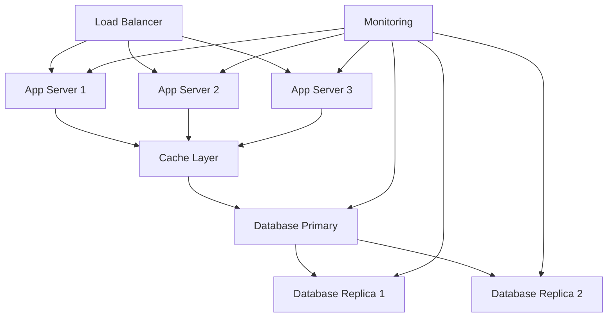

# Day 28: Production Deployment and Monitoring

## Overview
Today we'll explore production deployment strategies, monitoring systems, and maintaining high-availability Nexios applications.

## Learning Objectives
- Master deployment strategies
- Implement monitoring systems
- Understand high availability
- Configure logging systems
- Implement disaster recovery

## Topics

### 1. Production Architecture



### 2. Deployment Strategy Implementation

```python
from nexios.deploy import DeploymentManager
from nexios.rollout import RolloutStrategy

# Deployment configuration
deploy = DeploymentManager(
    app_name="nexios-production",
    regions=["us-east", "eu-west", "asia-east"]
)

# Blue-Green deployment
async def blue_green_deployment():
    # Prepare new environment
    green = await deploy.prepare_environment(
        version="2.0.0",
        config={
            "instances": 3,
            "memory": "4Gi",
            "cpu": "2"
        }
    )
    
    # Run health checks
    health = await green.check_health(
        endpoints=["/health", "/ready"],
        timeout=300
    )
    
    if health.is_healthy:
        # Switch traffic
        await deploy.switch_traffic(
            from_env="blue",
            to_env="green",
            strategy="gradual",
            duration=600  # 10 minutes
        )
    else:
        await green.rollback()

# Canary deployment
async def canary_deployment():
    canary = await deploy.create_canary(
        version="2.0.0",
        traffic_percentage=10,
        metrics=[
            "error_rate",
            "response_time",
            "cpu_usage"
        ]
    )
    
    # Monitor canary
    result = await canary.monitor(
        duration=1800,  # 30 minutes
        thresholds={
            "error_rate": 1.0,  # 1%
            "response_time": 200,  # ms
            "cpu_usage": 70  # percent
        }
    )
    
    if result.is_successful:
        await canary.promote_to_production()
    else:
        await canary.rollback()
```

### 3. Monitoring and Observability

```python
from nexios.monitoring import MonitoringSystem
from nexios.metrics import MetricsCollector
from nexios.tracing import DistributedTracer

# Monitoring setup
monitoring = MonitoringSystem(
    collectors=[
        "prometheus",
        "grafana",
        "datadog"
    ],
    retention_days=30,
    alert_channels=[
        "email",
        "slack",
        "pagerduty"
    ]
)

# Metrics collection
metrics = MetricsCollector(
    metrics=[
        "http_requests_total",
        "http_request_duration_ms",
        "database_connections",
        "cache_hit_ratio",
        "error_rate"
    ],
    labels={
        "environment": "production",
        "region": "us-east",
        "version": "2.0.0"
    }
)

# Distributed tracing
tracer = DistributedTracer(
    service_name="nexios-api",
    sample_rate=0.1,
    exporters=[
        "jaeger",
        "zipkin"
    ]
)

@tracer.trace
async def process_request(request):
    with tracer.span("validate_request"):
        await validate_request(request)
    
    with tracer.span("process_data"):
        result = await process_data(request.data)
    
    with tracer.span("store_result"):
        await store_result(result)
    
    return result
```

### 4. Logging and Error Tracking

```python
from nexios.logging import LogManager
from nexios.errors import ErrorTracker

# Logging configuration
logs = LogManager(
    sinks=[
        "elasticsearch",
        "cloudwatch",
        "stackdriver"
    ],
    format="json",
    retention_days=90,
    index_pattern="nexios-logs-{YYYY.MM.DD}"
)

# Error tracking
error_tracker = ErrorTracker(
    service="sentry",
    environment="production",
    release="2.0.0",
    sample_rate=1.0
)

@error_tracker.capture
async def handle_request(request):
    try:
        return await process_request(request)
    except Exception as e:
        error_tracker.capture_exception(
            e,
            level="error",
            tags={
                "endpoint": request.path,
                "method": request.method
            },
            extra={
                "request_id": request.id,
                "user_id": request.user.id
            }
        )
        raise
```

### 5. High Availability and Disaster Recovery

```python
from nexios.ha import HighAvailability
from nexios.backup import BackupManager

# High availability configuration
ha = HighAvailability(
    regions=["us-east", "eu-west"],
    failover_strategy="automatic",
    health_check_interval=30,
    min_replicas=3
)

# Backup management
backup = BackupManager(
    schedule={
        "full": "0 0 * * *",      # Daily full backup
        "incremental": "0 */6 * * *"  # Every 6 hours
    },
    retention={
        "daily": 7,
        "weekly": 4,
        "monthly": 3
    },
    storage={
        "type": "azure_blob",
        "container": "nexios-backups",
        "encryption": True
    }
)

# Disaster recovery
async def disaster_recovery():
    # Detect failure
    if await ha.detect_failure("primary"):
        # Initiate failover
        await ha.failover_to_secondary(
            wait_for_sync=True,
            timeout=300
        )
        
        # Restore from backup if needed
        if await ha.needs_restore():
            await backup.restore_latest(
                target="secondary",
                validate=True
            )
        
        # Update DNS
        await ha.update_dns_records(
            ttl=300  # 5 minutes
        )
```

## Practical Exercises

1. Implement deployment strategies
2. Set up monitoring systems
3. Configure logging
4. Implement high availability
5. Test disaster recovery

## Best Practices

1. Use gradual deployments
2. Monitor everything
3. Implement proper logging
4. Plan for failures
5. Regular backup testing
6. Document procedures

## Homework Assignment

1. Create deployment strategy
2. Set up monitoring
3. Implement logging
4. Configure backups
5. Test disaster recovery

## Additional Resources

- [Production Deployment Guide](https://nexios.io/deployment)
- [Monitoring Best Practices](https://nexios.io/monitoring)
- [High Availability Guide](https://nexios.io/ha)
- [Disaster Recovery](https://nexios.io/disaster-recovery) 