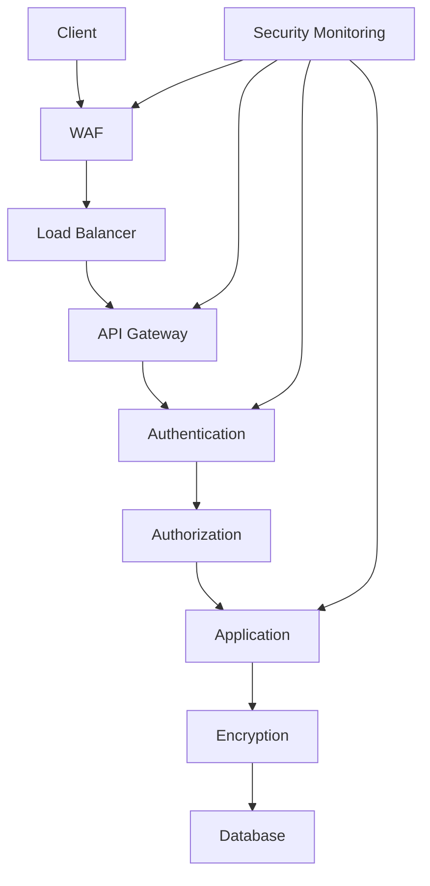

# Day 29: Advanced Security and Compliance

## Overview
Today we'll explore advanced security practices, compliance requirements, and implementing secure systems in Nexios applications.

## Learning Objectives
- Master security best practices
- Implement compliance requirements
- Understand security auditing
- Configure security monitoring
- Implement secure communications

## Topics

### 1. Security Architecture



### 2. Authentication and Authorization

```python
from nexios.security import SecurityManager
from nexios.auth import AuthProvider, MFA

# Security configuration
security = SecurityManager(
    auth_providers=[
        "oauth2",
        "saml",
        "openid"
    ],
    session_config={
        "timeout": 3600,
        "refresh_enabled": True,
        "secure": True,
        "http_only": True
    }
)

# Multi-factor authentication
mfa = MFA(
    providers=[
        "totp",
        "sms",
        "email"
    ],
    required_factors=2,
    remember_device=True
)

@security.authenticate
@mfa.require
async def secure_endpoint(request):
    user = request.user
    
    # Verify permissions
    if not await security.has_permission(user, "admin"):
        raise PermissionDenied()
    
    # Log security event
    await security.audit_log.record(
        "secure_access",
        user=user,
        action="admin_operation",
        resource="sensitive_data"
    )
    
    return {"status": "success"}
```

### 3. Data Protection and Encryption

```python
from nexios.security import Encryption
from nexios.crypto import KeyManager

# Encryption configuration
encryption = Encryption(
    algorithms={
        "aes-256-gcm": {
            "key_size": 256,
            "mode": "GCM",
            "iv_size": 12
        },
        "chacha20-poly1305": {
            "key_size": 256,
            "nonce_size": 12
        }
    }
)

# Key management
key_manager = KeyManager(
    provider="azure-keyvault",
    rotation_schedule="30 days",
    backup_enabled=True
)

class SecureData:
    def __init__(self, data: dict):
        self.data = data
        self.encryption = encryption
    
    async def encrypt(self):
        # Get encryption key
        key = await key_manager.get_current_key()
        
        # Encrypt sensitive fields
        encrypted_data = {}
        for field, value in self.data.items():
            if self.is_sensitive(field):
                encrypted_data[field] = await self.encryption.encrypt(
                    value,
                    key=key,
                    algorithm="aes-256-gcm"
                )
            else:
                encrypted_data[field] = value
        
        return encrypted_data
    
    async def decrypt(self, encrypted_data: dict):
        # Get decryption key
        key = await key_manager.get_key(encrypted_data["key_id"])
        
        # Decrypt sensitive fields
        decrypted_data = {}
        for field, value in encrypted_data.items():
            if self.is_sensitive(field):
                decrypted_data[field] = await self.encryption.decrypt(
                    value,
                    key=key,
                    algorithm="aes-256-gcm"
                )
            else:
                decrypted_data[field] = value
        
        return decrypted_data
```

### 4. Security Monitoring and Auditing

```python
from nexios.security import SecurityMonitor
from nexios.audit import AuditLogger

# Security monitoring
monitor = SecurityMonitor(
    rules=[
        {
            "name": "brute_force_detection",
            "condition": "failed_login_attempts > 5",
            "window": "5m",
            "action": "block_ip"
        },
        {
            "name": "suspicious_activity",
            "condition": "unusual_access_pattern",
            "window": "1h",
            "action": "alert_admin"
        }
    ],
    alerts={
        "email": ["security@company.com"],
        "slack": "#security-alerts",
        "pagerduty": "security-team"
    }
)

# Audit logging
audit = AuditLogger(
    storage="elasticsearch",
    retention_days=365,
    fields=[
        "timestamp",
        "user_id",
        "action",
        "resource",
        "ip_address",
        "user_agent"
    ]
)

@audit.log
async def sensitive_operation(request):
    # Record audit event
    await audit.record(
        event_type="data_access",
        user=request.user,
        resource="sensitive_data",
        action="read",
        metadata={
            "ip": request.client.host,
            "user_agent": request.headers.get("User-Agent")
        }
    )
```

### 5. Compliance Implementation

```python
from nexios.compliance import ComplianceManager
from nexios.privacy import PrivacyManager

# Compliance configuration
compliance = ComplianceManager(
    frameworks=[
        "gdpr",
        "hipaa",
        "pci-dss"
    ],
    data_retention={
        "user_data": 365,  # days
        "payment_data": 180,
        "logs": 730
    }
)

# Privacy management
privacy = PrivacyManager(
    consent_required=True,
    data_subject_rights={
        "access": True,
        "rectification": True,
        "erasure": True,
        "portability": True
    }
)

@compliance.enforce
async def handle_user_data(request):
    # Check consent
    if not await privacy.has_consent(request.user):
        raise ConsentRequired()
    
    # Process with compliance
    data = await process_user_data(request.data)
    
    # Log compliance event
    await compliance.log_event(
        "data_processing",
        user=request.user,
        data_type="personal",
        purpose="service_delivery"
    )
    
    return data
```

## Practical Exercises

1. Implement secure authentication
2. Set up encryption
3. Configure security monitoring
4. Implement compliance
5. Set up audit logging

## Best Practices

1. Defense in depth
2. Least privilege access
3. Regular security audits
4. Proper data encryption
5. Compliance monitoring
6. Incident response plan

## Homework Assignment

1. Implement security features
2. Set up compliance
3. Configure monitoring
4. Create audit system
5. Document security measures

## Additional Resources

- [Security Best Practices](https://nexios.io/security)
- [Compliance Guide](https://nexios.io/compliance)
- [Encryption Guide](https://nexios.io/encryption)
- [Audit Logging](https://nexios.io/audit) 