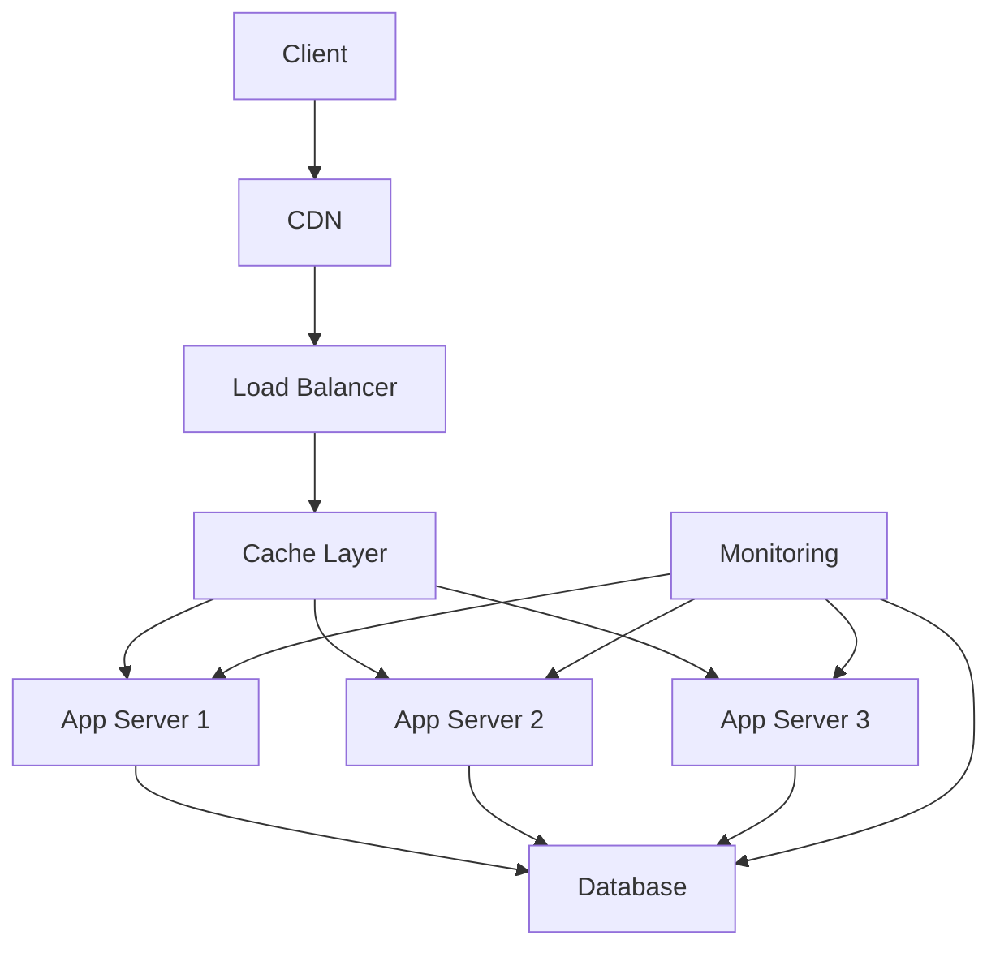

# Day 30: Advanced Performance Optimization

## Overview
Today we'll explore advanced performance optimization techniques, profiling, and scaling strategies for Nexios applications.

## Learning Objectives
- Master performance optimization
- Implement caching strategies
- Understand profiling tools
- Configure load balancing
- Implement scaling patterns

## Topics

### 1. Performance Architecture



### 2. Caching Implementation

```python
from nexios.cache import CacheManager
from nexios.performance import PerformanceOptimizer

# Cache configuration
cache = CacheManager(
    providers=[
        {
            "type": "redis",
            "url": "redis://cache:6379",
            "db": 0
        },
        {
            "type": "memcached",
            "hosts": ["cache1:11211", "cache2:11211"]
        }
    ],
    default_ttl=3600
)

# Performance optimization
optimizer = PerformanceOptimizer(
    cache=cache,
    compression_enabled=True,
    query_optimization=True
)

@optimizer.cache(ttl=300)
async def get_user_data(user_id: int):
    # Check cache first
    cache_key = f"user:{user_id}"
    if cached := await cache.get(cache_key):
        return cached
    
    # Get from database
    user = await db.fetch_user(user_id)
    
    # Cache the result
    await cache.set(cache_key, user)
    return user

@optimizer.optimize_query
async def get_user_orders(user_id: int):
    return await db.fetch_all("""
        SELECT o.*, p.name as product_name
        FROM orders o
        JOIN products p ON o.product_id = p.id
        WHERE o.user_id = :user_id
        ORDER BY o.created_at DESC
        LIMIT 100
    """, {"user_id": user_id})
```

### 3. Load Testing and Profiling

```python
from nexios.testing import LoadTester
from nexios.profiling import Profiler

# Load testing configuration
load_tester = LoadTester(
    target_url="https://api.nexios.io",
    scenarios=[
        {
            "name": "list_users",
            "weight": 30,
            "endpoint": "/users"
        },
        {
            "name": "get_user",
            "weight": 40,
            "endpoint": "/users/{user_id}"
        },
        {
            "name": "create_order",
            "weight": 30,
            "endpoint": "/orders",
            "method": "POST"
        }
    ]
)

# Application profiling
profiler = Profiler(
    enabled=True,
    sample_rate=0.1,
    trace_sql=True,
    trace_http=True
)

@profiler.profile
async def profile_endpoint():
    results = await load_tester.run(
        duration=300,  # 5 minutes
        users=100,
        ramp_up=30
    )
    
    # Analyze results
    analysis = await profiler.analyze(
        metrics=[
            "response_time",
            "throughput",
            "error_rate",
            "cpu_usage",
            "memory_usage"
        ]
    )
    
    return analysis
```

### 4. Database Optimization

```python
from nexios.db import DatabaseOptimizer
from nexios.query import QueryAnalyzer

# Database optimization
db_optimizer = DatabaseOptimizer(
    indexes_enabled=True,
    query_cache_size="1GB",
    connection_pool={
        "min_size": 10,
        "max_size": 100,
        "max_idle": 300
    }
)

# Query analysis
query_analyzer = QueryAnalyzer(
    explain_enabled=True,
    slow_query_threshold=1000,  # ms
    log_queries=True
)

@query_analyzer.analyze
async def optimize_queries():
    # Get slow queries
    slow_queries = await query_analyzer.get_slow_queries()
    
    # Optimize each query
    for query in slow_queries:
        optimization = await db_optimizer.optimize_query(
            query,
            suggestions=True
        )
        
        if optimization.requires_index:
            await db_optimizer.create_index(
                table=optimization.table,
                columns=optimization.columns
            )
```

### 5. Scaling Implementation

```python
from nexios.scaling import AutoScaler
from nexios.metrics import MetricsCollector

# Auto scaling configuration
scaler = AutoScaler(
    min_instances=3,
    max_instances=10,
    target_cpu_utilization=70,
    scale_up_cooldown=300,
    scale_down_cooldown=600
)

# Metrics collection
metrics = MetricsCollector(
    metrics=[
        "requests_per_second",
        "response_time_p95",
        "cpu_usage",
        "memory_usage",
        "error_rate"
    ],
    interval=60
)

async def scale_application():
    # Collect current metrics
    current_metrics = await metrics.collect()
    
    # Determine if scaling is needed
    scaling_decision = await scaler.evaluate(
        metrics=current_metrics,
        rules=[
            {
                "metric": "cpu_usage",
                "threshold": 80,
                "duration": "5m",
                "action": "scale_up"
            },
            {
                "metric": "response_time_p95",
                "threshold": 500,
                "duration": "5m",
                "action": "scale_up"
            }
        ]
    )
    
    if scaling_decision.should_scale:
        await scaler.scale(
            direction=scaling_decision.direction,
            instances=scaling_decision.instances
        )
```

## Practical Exercises

1. Implement caching strategy
2. Optimize database queries
3. Set up load testing
4. Configure auto-scaling
5. Profile application

## Best Practices

1. Cache effectively
2. Optimize database queries
3. Use proper indexes
4. Monitor performance
5. Scale horizontally
6. Profile regularly

## Homework Assignment

1. Implement caching
2. Optimize queries
3. Set up profiling
4. Configure scaling
5. Document optimizations

## Additional Resources

- [Performance Guide](https://nexios.io/performance)
- [Caching Strategies](https://nexios.io/caching)
- [Database Optimization](https://nexios.io/db-optimization)
- [Scaling Guide](https://nexios.io/scaling) 