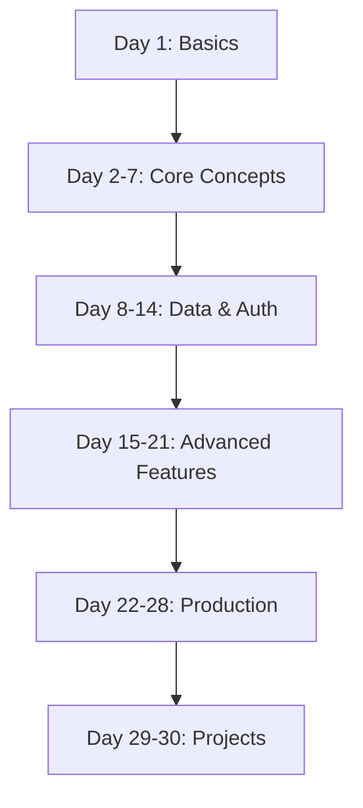

# 30 Days of Nexios

Welcome to the comprehensive 30-day course on Nexios web framework! This course will take you from the basics to advanced concepts, with hands-on examples and projects.

## Course Structure

Each day includes:
- Theory and concepts
- Code examples
- Practical exercises
- Mini-project
- Additional resources

## Prerequisites
- Basic Python knowledge
- Understanding of web concepts
- Familiarity with async programming
- Basic command line usage

## Course Outline

### Week 1: Fundamentals
- Day 1: [Introduction to Nexios](./day01/index.md)
- Day 2: [First Application & Routing](./day02/index.md)
- Day 3: [Request Handling & Responses](./day03/index.md)
- Day 4: [Path & Query Parameters](./day04/index.md)
- Day 5: [Basic Middleware](./day05/index.md)
- Day 6: [Error Handling](./day06/index.md)
- Day 7: [Project: RESTful API](./day07/index.md)

### Week 2: Data & Authentication
- Day 8: [Database Integration](./day08/index.md)
- Day 9: [Data Validation](./day09/index.md)
- Day 10: [Forms & File Uploads](./day10/index.md)
- Day 11: [Session Management](./day11/index.md)
- Day 12: [Authentication Basics](./day12/index.md)
- Day 13: [JWT & OAuth](./day13/index.md)
- Day 14: [Project: User Management System](./day14/index.md)

### Week 3: Advanced Features
- Day 15: [WebSockets Basics](./day15/index.md)
- Day 16: [Real-time Applications](./day16/index.md)
- Day 17: [Advanced Middleware](./day17/index.md)
- Day 18: [Custom Decorators](./day18/index.md)
- Day 19: [Dependency Injection](./day19/index.md)
- Day 20: [Background Tasks](./day20/index.md)
- Day 21: [Project: Chat Application](./day21/index.md)

### Week 4: Production & Best Practices
- Day 22: [Testing Strategies](./day22/index.md)
- Day 23: [Logging & Monitoring](./day23/index.md)
- Day 24: [Performance Optimization](./day24/index.md)
- Day 25: [Security Best Practices](./day25/index.md)
- Day 26: [Deployment Strategies](./day26/index.md)
- Day 27: [Docker & Containers](./day27/index.md)
- Day 28: [Project: Production-Ready API](./day28/index.md)

### Week 5: Advanced Projects
- Day 29: [Building Extensions](./day29/index.md)
- Day 30: [Final Project](./day30/index.md)

## Getting Started

To begin the course:

1. Install Python 3.8 or later:
   ```bash
   python --version
   ```

2. Create a virtual environment:
   ```bash
   python -m venv venv
   source venv/bin/activate  # Linux/Mac
   venv\Scripts\activate     # Windows
   ```

3. Install Nexios:
   ```bash
   pip install nexios
   ```

4. Clone the course repository:
   ```bash
   git clone https://github.com/yourusername/nexios-course
   cd nexios-course
   ```

## Course Projects

Throughout the course, you'll build:
1. Basic REST API
2. User Management System
3. Real-time Chat Application
4. Production-Ready API
5. Custom Framework Extension

## Learning Path



## Additional Resources
- [Official Documentation](https://nexios.dev)
- [GitHub Repository](https://github.com/yourusername/nexios)
- [Community Forum](https://community.nexios.dev)
- [Video Tutorials](https://youtube.com/nexios)

## Support

If you need help:
- Join our [Discord server](https://discord.gg/nexios)
- Ask questions on [Stack Overflow](https://stackoverflow.com/questions/tagged/nexios)
- File issues on [GitHub](https://github.com/yourusername/nexios/issues)

Let's start with [Day 1: Introduction to Nexios](./day01/index.md)! 