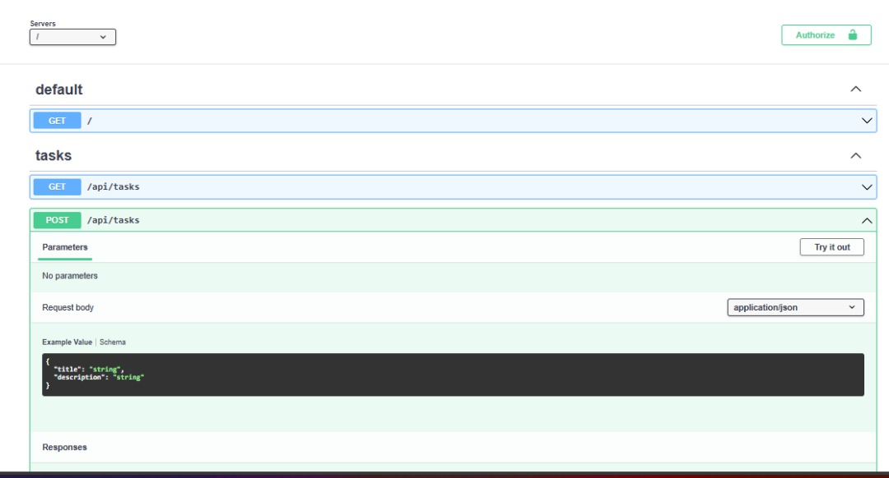

# What is Nexios ?

Nexios is a high-performance tool built with Python that helps developers create web applications quickly and efficiently. It focuses on being lightweight, developer-friendly, and easy to use, especially for those who enjoy writing clean, straightforward code. It supports features like routing, authentication, and async handling, allowing you to build scalable apps with minimal setup. It's designed with speed and clarity in mind, making it a solid choice for anyone who values productivity and performance.


### Installation



```sh
pip install nexios
```



```sh
poetry add nexios
```



```sh
uv pip install nexios
```



```sh
git clone https://github.com/nexios-labs/Nexios.git
cd Nexios
pip install -e .

```



### Quick Start

#### Simple Hello World

Your first Nexios application can be as simple as:

```python
from nexios import get_application

app = get_application()

@app.get("/")
async def hello(request, response):
    return response.json({"message": "Hello, World!"})


```

#### Adding Middleware

Enhance your application with middleware:

```python
from nexios import get_application

async def JSONMiddleware(request, response, next):
    request.json = process_json(request.body)
    return await next()

app = get_application()
app.use(JSONMiddleware)

@app.get("/")
async def index(request, response):
    return response.json({"message": "Welcome to Nexios!"})
```

#### Creating Routes with Parameters

Define routes with dynamic parameters:

```python
@app.get("/users/{user_id}")
async def get_user(request, response):
    user_id = request.path_params["user_id"]
    return response.json({"user_id": user_id})
```

#### Working with Different HTTP Methods

Handle various HTTP methods with ease:

```python
@app.post("/users")
async def create_user(request, response):
    user_data = await request.json
    # Process user data
    return response.json({"created": True, "user": user_data})

@app.put("/users/{user_id}")
async def update_user(request, response):
    user_id = request.path_params["user_id"]
    updates = await request.json
    # Update user with ID
    return response.json({"updated": True, "id": user_id})

@app.delete("/users/{user_id}")
async def delete_user(request, response):
    user_id = request.path_params["user_id"]
    # Delete user with ID
    return response.json({"deleted": True, "id": user_id})
```

#### Using Pydantic for Data Validation

Leverage Pydantic for request validation:

```python
from pydantic import BaseModel
from typing import Optional

class UserCreate(BaseModel):
    username: str
    email: str
    full_name: Optional[str] = None

@app.post("/users")
async def create_user(request, response):
    data = await request.json
    user = UserCreate(**data)
    return response.json({"created": user.dict()})
```

#### Application Lifecycle Events

Handle startup and shutdown events:

```python
@app.on_startup
async def initialize_resources():
    print("Application starting up!")
    # Initialize database connections, etc.

@app.on_shutdown
async def cleanup_resources():
    print("Application shutting down!")
    # Close connections, free resources, etc.
```


### 🛠️ CLI Tools

Nexios includes a powerful CLI tool to help you bootstrap projects and run development servers:

#### Creating a New Project

```bash
nexios new my_project
```

Options:

* `--output-dir, -o`: Directory where the project should be created (default: current directory)
* `--title`: Display title for the project (defaults to project name)

#### Running the Development Server

```bash
nexios run
```

Options:

* `--app, -a`: Application import path (default: main:app)
* `--host`: Host to bind the server to (default: 127.0.0.1)
* `--port, -p`: Port to bind the server to (default: 4000)
* `--reload/--no-reload`: Enable/disable auto-reload (default: enabled)
* `--log-level`: Log level for the server (default: info)
* `--workers`: Number of worker processes (default: 1)


### 📸 OpenAPI Documentation

<div align="center"></div>

After running your Nexios application, visit `http://localhost:4000/docs` to access the automatically generated Swagger documentation.

### 🗣️ What Developers Say

> "Adopting Nexios at our startup has been a practical and effective choice. In a fast-moving development environment, we needed something lightweight and efficient — Nexios met that need.
>
> Its clean architecture and compatibility with different ORMs helped our team work more efficiently and keep things maintainable. One of its strengths is how straightforward it is — minimal overhead, just the tools we need to build and scale our backend services."
>
> — Joseph Mmadubuike, Chief Technology Officer at buzzbuntu.com

### 🤝 Join Our Community

Get involved with Nexios development and connect with other developers:

[](https://chat.whatsapp.com/KZBM6HMmDZ39yzr7ApvBrC)

[](https://nexios-labs.gitbook.io/nexios)

* 📚 [Read the Docs](https://nexios-labs.gitbook.io/nexios)
* 💬 [Join WhatsApp Group](https://chat.whatsapp.com/KZBM6HMmDZ39yzr7ApvBrC)
* 🐱 [GitHub Repository](https://github.com/nexios-labs/Nexios)
* 🐛 [Report Issues](https://github.com/nexios-labs/Nexios/issues)
* 🤝 [Contribute](../CONTRIBUTING.md)

### ☕ Support Nexios

Nexios is a passion project built to make backend development in Python faster, cleaner, and more developer-friendly. It's fully open-source and maintained with love, late nights, and lots of coffee.

If Nexios has helped you build something awesome, consider supporting its continued development. Your donation helps cover:

* 📚 Documentation hosting and tools
* 🚀 New feature development
* 🐛 Bug fixes and maintenance
* 🎓 Tutorial and example creation
* 🌐 Community support resources

[](https://www.buymeacoffee.com/techwithdul)

Every contribution, no matter how small, helps keep Nexios growing and improving. Thank you for your support! 🙏

### 📚 Full Documentation

For complete documentation, visit our [GitBook](https://nexios-labs.gitbook.io/nexios).

### Star the repo if you like it! ⭐
